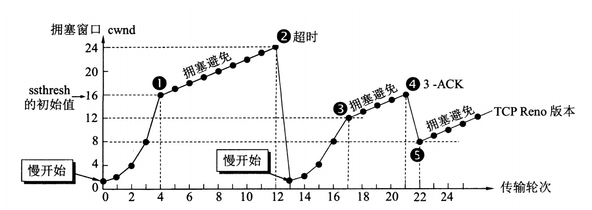

## 七层网络概念


### 应用层

**应用层(application-layer）的任务是通过应用进程间的交互来完成特定网络应用。应用层协议定义的是应用进程（进程：主机中正在运行的程序）间的通信和交互的规则**。对于不同的网络应用需要不同的应用层协议。在互联网中应用层协议很多，如**域名系统DNS**，支持万维网应用的 **HTTP协议**，支持电子邮件的 **SMTP协议等等。我们把应用层交互的数据单元称为报文。

#### 域名系统DNS

DNS作为可以将域名和IP地址相互映射的一个分布式数据库，能够使人更方便的访问互联网，而不用去记住能够被机器直接读取的IP数串。

简单的说就是域名是网址，比如百度`www.baidu.com`，其IP为`183.232.231.172`(命令 `Ping www.baidu.com`)。

DNS的作用就是将百度网址解析为 IP 地址。

#### HTTP协议与HTTPS协议

- HTTP：超文本传输协议。HTTPS：安全套接字层超文本传输协议HTTP+SSL
- HTTP 的URL 以http:// 开头，而HTTPS 的URL 以https:// 开头
- HTTP 是不安全的，而 HTTPS 是安全的（没有绝对的安全，只有相对的安全）

- HTTP：无法加密（客户端和服务器端传递的是明文的消息）。HTTPS：对传输的数据进行加密（将明文进行加密后再在客户端和服务器之前进行传递）。

  HTTPS采用非对称加密和对称加密两种加密方式来保证传输信息的安全性：

  非对称加密：用公钥和私钥来加解密。对称加密：加密解密都用同一套秘钥。

- 在OSI 网络模型中，HTTP工作于应用层，而HTTPS 的安全传输机制工作在传输层
- HTTP采用80端口，而HTTPS采用443端口。

- HTTPS需要申请证书。

### 运输层

**运输层(transport layer)的主要任务是为两台主机进程之间的通信提供通用的数据传输服务**。应用进程利用该服务传送应用层报文。“通用的”是指并不针对某一个特定的网络应用，而是多种应用可以使用同一个运输层服务。由于一台主机可同时运行多个线程，因此运输层有复用和分用的功能。所谓复用就是指多个应用层进程可同时使用下面运输层的服务，分用和复用相反，是运输层把收到的信息分别交付上面应用层中的相应进程。

#### 运输层主要使用的两种协议TCP/UDP

- **传输控制协议** TCP**（Transmisson Control Protocol）--提供**面向连接**的，**可靠的**数据传输服务。

- **用户数据报协议** UDP**（User Datagram Protocol）--提供**无连接**的，尽最大努力的数据传输服务（**不保证数据传输的可靠性**）。

两个计算机进程间的通信不仅仅要知道对方的 IP 地址（为了找到对方的计算机），也要知道对方的端口号（找到对方计算机中的应用进程）

**TCP报文段的首部格式**


1. **源端口和目的端口**。各占2字节。
2. **序号**: TCP每个一个字节都是按顺序编号。
3. **确认号**: 期望收到对方下一个报文段的第一个数据字节的序号。
4. **数据偏移**：占用4字节，指出TCP报文段数据处距离TCP报文段的起始处有多远。
5. **保留**: 占用6位，留以后使用。
6. **紧急URG**: URG=1表示紧急，告诉系统有紧急数据，应尽快传送，而不按原来的排队顺序来传送。
7. **确认ACK**：只有ACK=1时，确认号ack才有效。
8. **推送PSH**: 希望立即能够收到对方的响应。
9. **复位RST**：RST=1,表明连接中出现严重差错，必须释放连接，然后再重新建立运输连接。
10. **同步SYN**: 在连接建立时用来同步序号。当SYN=1，ACK=0时表示连接请求报文段。如果对方同意则响应报文中使用SYN=1,ACK=1.
11. **终止FIN**: 用来释放连接。
12. **窗口**：占两字节，窗口值作为接收方让发送方设置发送窗口的依据。
13. **校验和**：占2字节，校验和字段校验的范围包括首部和数据两部分。
14. **紧急指针**：占两字节，只有URG=1时才有意义，紧急指针指出紧急数据的末尾在报文段中的位置。
15. **选项**：长度可变，最长40字节。

**UDP报文段首部格式**


- **源端口**: 源端口号，在需要对方回信时选用，不需要时可用全0.
- **目的端口**: 目的端口号，在终点交付报文时必须使用
- **长度**: UDP用户数据报的长度，其最小值是8(仅有头部)。
- **校验和**: 检测UDP用户数据报在传输中是否有错。有错就丢弃。

#### TCP与UDP的区别

- TCP**面向连接**的，**可靠的**数据传输服务；UDP面向**无连接的**，尽最大努力的数据传输服务，**不保证数据传输的可靠性**
- **TCP面向字节流，UDP面向报文**
  - 应用进程交给 UDP 多长的报文， UDP 就照样发送，一次发送一个报文
  - TCP 在发送时采取的方式完全不同：TCP 根据对方给出的窗口值和当前网络拥塞的程度来决定一个报文段应该包含多少个字节。如果报文太长，TCP会将其拆分再发送，如果报文太短，TCP会等待积累足够多的字节后再构成报文段发送出去
- TCP数据传输慢，UDP数据传输快
- TCP有**拥塞控制**，UDP没有拥塞控制，因此网络出现拥塞不会使源主机的发送速率降低（对实时应用很有效，如直播，实时视频会议等）
- TCP 只能是一对一的通信（TCP连接的端点是套接字socket），而 UDP 支持一对一、一对多、多对一和多对多的通信
- TCP 的首部开销大，有 20 个字节，比 UDP 的 8 个字节的首部要长。
- TCP提供可靠**全双功**的通信服务。UDP是半双功，只能单向传播。

【注意】

TCP面向字节流中的“流”（Stream）指的是流入进程或从进程流出的字节序列。“面向字节流”的含义是：虽然应用程序和 TCP 的交互是一次一个数据块（大小不等），但 TCP 把应用程序交下来的数据仅仅看成是一连串的无结构的字节流。

另外TCP 提供全双工通信。TCP 允许通信双方的应用进程在任何时候都能发送数据。TCP 连接的两端都设有发送缓存和接收缓存，用来临时存放双方通信的数据；

套接字 socket = (IP地址：端口号)

TCP 连接定义为 {socket1, socket2} = { (IP1: port1), (IP2: port2) }

#### TCP与UDP的适用场景

- TCP 适用于效率要求相对低，但对准确性要求相对高的场景。因为传输中需要对数据确认、重发、排序等操作，相比之下效率没有UDP高。TCP 适用于电子邮件（SMTP）、远程终端接入（TELNET）、万维网（HTTP）、文件传送（FTP）
- UDP 适用于效率要求相对高，对准确性要求相对低的场景。如视频直播、QQ语音电话等即时通讯、广播通信。开销小（因为提供可靠的、面向连接的运输服务，会多很多开销比如确认、流量控制、计时器、连接管理等），也适用于简单文件传送（TFTP）、路由选择协议（RIP）、域名系统（DNS）等

魔兽世界用 TCP，英雄联盟、射击类对延迟要求特别高用 UDP，实际上英雄联盟是 TCP 和 UDP 混合使用的，比如创建房间用 TCP，团战中的伤害计算用 UDP。

#### TCP与UDP对应的协议

**TCP对应的协议**

 - **FTP(21)**：定义了**文件传输协议**，使用21端口。常说某某计算机开了FTP服务便是启动了文件传输服务。下载文件，上传主页，都要用到FTP服务。
 - **ssh(22)**: 专为**远程登录会话**和其他网络服务提供安全性的协议
 - **Telnet(23)**：(远程登陆协议)它是一种用于**远程登陆**的端口，用户可以以自己的身份远程连接到计算机上，通过这种端口可以提供一种基于DOS模式下的通信服务。如以前的BBS是-纯字符界面的，支持BBS的服务器将23端口打开，对外提供服务。
 - **SMTP(25)**：定义了**简单邮件传送协议**，现在很多邮件服务器都用的是这个协议，用于发送邮件。如常见的免费邮件服务中用的就是这个邮件服务端口，所以在电子邮件设置-中常看到有这么SMTP端口设置这个栏，服务器开放的是25号端口。
 - **POP3(110)**：它是和SMTP对应，POP3用于**接收邮件**。通常情况下，POP3协议所用的是110端口。也是说，只要你有相应的使用POP3协议的程序（例如Fo-xmail或Outlook），就可以不以Web方式登陆进邮箱界面，直接用邮件程序就可以收到邮件（如是163邮箱就没有必要先进入网易网站，再进入自己的邮-箱来收信）。
 - **HTTP(80)协议**：是从Web服务器传输超文本到本地浏览器的传送协议。

**UDP对应的协议**

- **DNS(53)**：用于域名解析服务，将域名地址转换为IP地址。DNS用的是53号端口。
- **RIP(520)**:路由信息协议，端口520
- **SNMP(161)**：简单网络管理协议，使用161号端口，是用来管理网络设备的。由于网络设备很多，无连接的服务就体现出其优势。
- **TFTP(69)(Trival File Transfer Protocal)**，简单文件传输协议，该协议在熟知端口69上使用UDP服务。

### 网络层

**网络层(network layer)负责为分组交换网上的不同主机提供通信服务。** 在发送数据时，网络层把运输层产生的报文段或用户数据报封装成分组和包进行传送。在 TCP/IP 体系结构中，由于网络层使用 **IP 协议**，因此分组也叫 **IP 数据报** ，简称 **数据报**。

网络层向上只提供简单灵活的、无连接的、尽最大努力交付的数据报服务。网络层不提供服务质量的承诺，也即是说，所传送的分组可能出错、丢失、重复和失序，当然也不保证分组交付的时限。如果进程之间的通信被要求为可靠的，就么就由运输层负责（包括差错处理、流量控制等）。

这里要注意：**不要把运输层的“用户数据报 UDP ”和网络层的“ IP 数据报”弄混**。另外，无论是哪一层的数据单元，都可笼统地用“分组”来表示。

网络层的另一个任务就是选择合适的路由，使源主机运输层所传下来的分组，能通过网络层中的路由器找到目的主机。

这里强调指出，网络层中的“网络”二字已经不是我们通常谈到的具体网络，而是指计算机网络体系结构模型中第三层的名称.

互联网是由大量的异构（heterogeneous）网络通过路由器（router）相互连接起来的。互联网使用的网络层协议是无连接的网际协议（Intert Prococol）和许多路由选择协议，因此互联网的网络层也叫做**网际层**或**IP层**。

#### IP地址的分类

- A类地址：以0开头， 第一个字节范围：0~126（1.0.0.0 - 126.255.255.255）；
- B类地址：以10开头， 第一个字节范围：128~191（128.0.0.0 - 191.255.255.255）；
- C类地址：以110开头， 第一个字节范围：192~223（192.0.0.0 - 223.255.255.255）；
- D类1110
- E类1111

10.0.0.0—10.255.255.255， 172.16.0.0—172.31.255.255， 192.168.0.0—192.168.255.255。（Internet上保留地址用于内部）IP地址与子网掩码相与得到网络号

#### 地址解析协议 ARP

网络层使用的是 IP 地址，但在实际网络的链路上传送数据帧时，最终还是得使用该网络的硬件地址（MAC地址）。地址解析协议 ARP 解决这个问题的方法是在主机 ARP 高速缓存中存放一个从 IP 地址到硬件地址的映射表，并且这个映射表还动态更新。（由于网络上经常会有主机加入或撤走）

###  数据链路层

**数据链路层(data link layer)通常简称为链路层。两台主机之间的数据传输，总是在一段一段的链路上传送的，这就需要使用专门的链路层的协议。** 在两个相邻节点之间传送数据时，**数据链路层将网络层交下来的 IP 数据报组装程帧**，在两个相邻节点间的链路上传送帧。每一帧包括数据和必要的控制信息（如同步信息，地址信息，差错控制等）。

在接收数据时，控制信息使接收端能够知道一个帧从哪个比特开始和到哪个比特结束。这样，数据链路层在收到一个帧后，就可从中提出数据部分，上交给网络层。
控制信息还使接收端能够检测到所收到的帧中有无差错。如果发现差错，数据链路层就简单地丢弃这个出了差错的帧，以避免继续在网络中传送下去白白浪费网络资源。如果需要改正数据在链路层传输时出现差错（这就是说，数据链路层不仅要检错，而且还要纠错），那么就要采用可靠性传输协议来纠正出现的差错。这种方法会使链路层的协议复杂些。

### 物理层

在物理层上所传送的数据单位是比特。
**物理层(physical layer)的作用是实现相邻计算机节点之间比特流的透明传送，尽可能屏蔽掉具体传输介质和物理设备的差异。** 使其上面的数据链路层不必考虑网络的具体传输介质是什么。“透明传送比特流”表示经实际电路传送后的比特流没有发生变化，对传送的比特流来说，这个电路好像是看不见的。

在互联网使用的各种协议中最重要和最著名的就是 TCP/IP 两个协议。现在人们经常提到的TCP/IP并不一定单指TCP和IP这两个具体的协议，而往往表示互联网所使用的整个TCP/IP协议族。

## 了解交换机、路由器、网关的概念，并知道各自的用途

两者简介：

 - **路由器**是具有多个输入输出端口的专用计算机，工作在网络层，**其任务是连接不同的网络并完成路由转发**。当源主机向目标主机发送数据报时，路由器先检查源主机与目标主机是否连接在一个网络上。如果源主机和目标主机在一个网络上则直接交付而无需通过路由器。但如果源主机和目标主机不在同一个网络上，则路由器转发表指出路由将数据报转发给下一个路由器，即间接交付。路由器隔离了广播域。

 - **交换机**：是多个端口的网桥，工作在数据链路层，**将两个或多个以太网连接起来成为更大的以太网。它能将网络分成小的冲突域，为每个工作站提供更高的带宽**。其原理是，检测从以太端口来的数据帧的源和目的地的MAC地址，然后与系统内部的动态查找表进行比较。若数据帧的MAC地址不在查找表中，则将该地址加入查找表中，并将数据帧发送给相应的端口。

区别：

 - **路由器**：工作在网络层，是能够连接不同的广域网形成更大的广域网。连接的是异构网络。根据IP地址转发。
 - **交换机**：工作在数据链路层，是将以太网连接形成更大的以太网，同一个网络。根据MAC地址进行转发。
 - **网关(Gateway)**又称网间连接器、协议转换器。网关在网络层以上实现网络互连，是最复杂的网络互连设备，**仅用于两个高层协议不同的网络互连**。网关既可以用于广域网互连，也可以用于局域网互连。 网关是一种充当转换重任的计算机系统或设备。使用在不同的通信协议、数据格式或语言，甚至体系结构完全不同的两种系统之间，网关是一个翻译器。

## 运输层重要知识点

### 可靠传输的工作原理

**停止等待协议**

**连续ARQ协议**

直接阅读这个博客[TCP可靠传输的工作原理-停止等待&连续的ARQ（计算机网络谢希仁 P198~202）](https://blog.csdn.net/turn__back/article/details/73743641)

### 滑动窗口

- TCP 利用滑动窗口实现流量控制的机制。
- 滑动窗口（Sliding window）是一种流量控制技术。早期的网络通信中，通信双方不会考虑网络的拥挤情况直接发送数据。由于大家不知道网络拥塞状况，同时发送数据，导致中间节点阻塞掉包，谁也发不了数据，所以就有了滑动窗口机制来解决此问题。
- TCP 中采用滑动窗口来进行传输控制，滑动窗口的大小意味着接收方还有多大的缓冲区可以用于接收数据。发送方可以通过滑动窗口的大小来确定应该发送多少字节的数据。当滑动窗口为 0 时，发送方一般不能再发送数据报，但有两种情况除外，一种情况是可以发送紧急数据，例如，允许用户终止在远端机上的运行进程。另一种情况是发送方可以发送一个 1 字节的数据报来通知接收方重新声明它希望接收的下一字节及发送方的滑动窗口大小。

### TCP流量控制

- TCP 利用滑动窗口实现流量控制。
- 流量控制是为了控制发送方发送速率，保证接收方来得及接收。
- 接收方发送的确认报文中的窗口字段可以用来控制发送方窗口大小，从而影响发送方的发送速率。将窗口字段设置为 0，则发送方不能发送数据。

### TCP拥塞控制

为了更好对TCP进行拥塞控制，因特网建议标准定义了以下四种算法：**慢开始，拥塞避免，快重传，快恢复**。
首先在TCP要求发送端维护两个窗口：

 - **接收窗口 rwnd**: 接收方根据当前缓存大小所许诺的最新窗口值.
 - **拥塞窗口 cwnd**: 发送方根据自己估算的网络拥塞程度而设置的窗口值。(congestion window)

**发送窗口的上限是取这两者(接收窗口、拥塞窗口)的最小值**。

**发送方如何知道网络发生了拥塞？**

答：当网络发生拥塞时，路由器就要丢弃分组，只要当发送方没有收到按时到达的确认报文，就可以猜想网络出现了拥塞。



 - **慢开始**： TCP刚连接好时，先令拥塞窗口cwnd =1 ,在每次收到一个对新报文段的确认时将cwnd加1（因此是成倍增长2的n次方). cwnd的大小呈指数增长。

 - **拥塞避免算法**： 当cwnd大于等于慢开始门限**ssthresh**时，cwnd窗口每次加 1 而不是加倍，这是因为线性规律增长，使网络不容易出现拥塞。当发送方检测到**超时事件**的发生时，**就将慢开始门限ssthresh设置为当前cwnd的一半，同时将cwnd设置为1**. 这样的目的是迅速减少主机发送到网络的分组数，使得发生拥塞的路由器有足够的时间把队列中积压的分组处理完毕。

 - **快重传**：接收方每收到一个**失序的报文段**后就立即发出重复确认（为的是使发送方及早知道有报文段没有到达对方）当发送方连续收到**三个重复的ACK报文时**，就立即进行重传。直接重传对方尚未收到的报文段，而不必等待那个报文段设置的重传计时器超时。

 - **快恢复**：当发送端收到连续三个冗余的ACK时，发送端调整门限值 **cwnd = ssthresh = cwnd / 2**, 即发送端口、阈值都等于当前窗口的一半。

   因为收到失序的报文并不能认为网络发生拥塞（如果发生了拥塞，就不会有连续几个报文段连续到达接收方），所以这个时候不是执行慢开始算法，而是把 cwnd 值设置为门限 ssthresh 的一半，然后执行拥塞避免算法。


### TCP的可靠性如何保证

在TCP的连接中，数据流必须以正确的顺序送达对方。TCP的可靠性是通过确认机制来保证安全的到达，即采用顺序编号、确认（ACK）、超时重传等来实现的。TCP在开始传送一个段时，为准备重传而首先将该段插入到发送队列之中，同时启动时钟。其后，如果收到了接受端对该段的ACK信息，就将该段从队列中删去。如果在时钟规定的时间内，ACK未返回，那么就从发送队列中再次送出这个段。TCP在协议中就对数据可靠传输做了保障，握手与断开都需要通讯双方确认，数据传输也需要双方确认成功，在协议中还规定了：分包、重组、重传等规则；而UDP主要是面向不可靠连接的，不能保证数据正确到达目的地。 

### TCP的三次握手与四次挥手过程，各个状态名称与含义，

#### 三次握手(建立连接)


- **第一次握手**：客户机首先向服务器的TCP发送一个连接请求报文段，这个特殊的报文段不含应用层数据，其首部中**同步位SYN**被设置为1。另外，客户机会随机选择一个**起始序号seq**=x(连接请求报文不携带数据，但要消耗一个序号)；

- **第二次握手**：服务器的TCP收到连接请求报文段后，如果同意建立连接，就向客户机发回确认，并为该TCP连接分配TCP缓存和变量。在确认报文段中，SYN和ACK位都被设置为1，**确认号字段**值为ack=x+1,并且服务器随机产生起始序号seq=y. 确认包同样不包含应用层数据。

- **第三次握手**：当客户机收到确认报文段后，还要向服务器给出确认，并且也要给该连接**分配缓存和变量**。这个报文段的确认位ACK被设置为1，序号段被设置为seq=x+1,确认号字段ack=y+1. 该报文段可以携带数据，如果不携带数据则不消耗序号。

**简单版本的三次握手**

- 第一次握手：客户端给服务器发送一个 SYN 报文。
- 第二次握手：服务器收到 SYN 报文之后，会应答一个 SYN+ACK 报文。
- 第三次握手：客户端收到 SYN+ACK 报文之后，会回应一个 ACK 报文。服务器收到 ACK 报文之后，三次握手建立完成。

### 为什么会采用三次握手，二次握手可以吗？

**采用三次握手是为了防止失效的连接请求报文段再次传到服务器**，因而产生错误。如果由于网络不稳定，虽然客户端以前发送的连接请求已到达服务器，但服务器的同意连接的应答未能到达客户端。则客户端要重新发送连接请求，**若采用二次握手，服务方收到客服端重传的失效请求连接后，会以为是新的请求，就会发送同意连接报文，并新开进程提供服务**，这样会造成服务方资源的无谓浪费。如果采用三次握手，即使收到了客服端重传的失效的请求连接，服务端即使以为是新的连接请求，发送了确认连接报文，但由于客户端不会向服务端的确认发送确认，服务端收不到客户端的确认，就知道客户端没有要求建立连接（就知道收到的是失效的连接请求）。

**另外的作用是为了确认双方的接收与发送能力是否正常。**

```markdown
这里我顺便解释一下为啥只有三次握手才能确认双方的接受与发送能力是否正常，而两次却不可以：
第一次握手：客户端发送网络包，服务端收到了。

这样服务端就能得出结论：客户端的发送能力、服务端的接收能力是正常的。
第二次握手：服务端发包，客户端收到了。

这样客户端就能得出结论：服务端的接收、发送能力，客户端的接收、发送能力是正常的。不过此时服务器并不能确认客户端的接收能力是否正常。
第三次握手：客户端发包，服务端收到了。

这样服务端就能得出结论：客户端的接收、发送能力正常，服务器自己的发送、接收能力也正常。

因此，需要三次握手才能确认双方的接收与发送能力是否正常。

理想状态下，TCP连接一旦建立，在通信双方中的任何一方主动关闭连接之前，TCP 连接都将被一直保持下去。因为TCP提供全双工通信，因此双方任何时候都可以发送数据。
```

#### 三次握手的作用

- 确认双方的接受能力、发送能力是否正常。
- 指定自己的初始化序列号，**为后面的可靠传送做准备**。
- 如果是 HTTPS 协议的话，三次握手这个过程，还会进行数字证书的验证以及加密密钥的生成。

#### 三次握手过程中可以携带数据吗

很多人可能会认为三次握手都不能携带数据，其实第三次握手的时候，是可以携带数据的。

也就是说，第一次、第二次握手不可以携带数据，而第三次握手是可以携带数据的。

为什么这样呢?大家可以想一个问题，**假如第一次握手可以携带数据的话，如果有人要恶意攻击服务器，那他每次都在第一次握手中的 SYN 报文中放入大量的数据。**

因为攻击者根本就不理服务器的接收、发送能力是否正常，然后疯狂着重复发 SYN 报文的话，这会让服务器花费很多时间、内存空间来接收这些报文。

也就是说，第一次握手可以放数据的话，其中一个简单的原因就是会让服务器更加容易受到攻击了。

而对于第三次的话，此时客户端已经处于 established 状态，也就是说，对于客户端来说，他已经建立起连接了，并且也已经知道服务器的接收、发送能力是正常的了，所以能携带数据。

#### 四次挥手


- **第一次挥手**：客户机打算关闭连接，就向其TCP发送一个连接释放报文，并停止再发送数据，主动关闭TCP连接。该报文段的结束标志位FIN被设置为1，seq=u,它等于前面已经发送过的数据的最后一个字节的序号加1。
- **第二次挥手**：服务器收到连接释放报文段后即发出确认，确认号是ack=u+1,序号为v,等于它前面已经发送过的数据的最后一个字节序号加1.此时客户机到服务器这个方向的连接就释放了，TCP处于半关闭状态。ACK=1，seq=v,ack=u+1
- **第三次挥手**：若服务器已经没有要向客户机发送的数据，就通知TCP释放连接，此时发出FIN=1，确认号ack=u+1,序号seq=w,已经发送过的数据最后一个字节加1。确认为ACK=1.(FIN=1, ACK=1, seq=w, ack=u+1) 
- **第四次挥手**：客户机收到连接释放报文段后，必须发出确认。在确认报文段中，确认位ACK=1，序号seq=u+1,确认号ack=w+1. 此时连接还没有释放掉，必须经过时间等待计时器设置的时间2MSL(Max Segment Lifetime),后，客户机才进入连接关闭状态。(ACK=1,seq=u+1,ack=w+1)

[TCP的三次握手(建立连接）和四次挥手(关闭连接）](https://www.cnblogs.com/Jessy/p/3535612.html) 

### TIMEWAIT的作用（为什么四次挥手，主动方要等待２MSL后才关闭连接）

一、保证TCP协议的全双工连接能够可靠关闭．

主要为了确保对方能受到ACK信息. 如果Client直接CLOSED了，那么由于IP协议的不可靠性或者是其它网络原因，导致Server没有收到Client最后回复的ACK。那么Server就会在超时之后继续发送FIN，此时由于Client已经CLOSED了，就找不到与重发的FIN对应的连接，最后Server就会收到RST而不是ACK，Server就会以为是连接错误把问题报告给高层。所以，Client不是直接进入CLOSED，而是要保持2MSL,如果在这个时间内又收到了server的关闭请求时可以进行重传，否则说明server已经受到确认包则可以关闭.


https://www.zhihu.com/question/36930631

### 浏览器上输入http://www.baidu.com发生了什么？

- 1) 浏览器分析连接指向的页面URL(http://www.baidu.com)
- 2) 浏览器向DNS请求www.baidu.com.的IP地址
- 3) 域名系统DNS解析出百度官网的服务器IP地址
- 4) 浏览器与该服务器建立TCP连接（默认端口80）
- 5) 浏览器发出HTTP请求，获取指定页面。
- 6) 服务器通过HTTP响应把文件对应页面发送给浏览器。
- 7) TCP连接释放。
- 8) 浏览器将文件进行解析，并将web网页显示给用户。

### http常见错误码

 - 2xx 成功：
   - **200 OK**：一切正常
 - 3xx 重定向：
   -  301 Moved Permanently: 客户请求的文档在其他地方
 - 4xx  客户机中出现的错误 
   - **400 Bad Request**: 请求出现语法错误。 
   - **401 Unauthorized**: 客户试图未经授权访问受密码保护的页面。
   - **403 Forbidden**: 资源不可用,服务器理解客户的请求，但拒绝处理它。通常由于服务器上文件或目录的权限设置导致。
   - **404 Not Found**: 无法找到指定位置的资源。这也是一个常用的应答。 
 - 5xx  服务器中出现的错误:
   - **500 Internal Server Error**: 服务器遇到了意料不到的情况，不能完成客户的请求。
   - **501 Not Implemented** 服务器不支持实现请求所需要的功能。例如，客户发出了一个服务器不支持的PUT请求。 
   - **502 Bad Gateway**: 服务器作为网关或者代理时，为了完成请求访问下一个服务器，但该服务器返回了非法的应答。
   - **503 Service Unavailable**: 服务器由于维护或者负载过重未能应答。
   - **504 Gateway Timeout**: 由作为代理或网关的服务器使用，表示不能及时地从远程服务器获得应答。
   - **505 HTTP Version Not Supported**:服务器不支持请求中所指明的HTTP版本。（HTTP 1.1新）

## 面向连接和非面向连接的服务的特点是什么？

面向连接的服务：通信双方进行通信之前，必须先建立连接，在通信过程中，整个连接情况一直都是被实时地监控和管理。当通信结束后，则应释放这个连接。
无连接服务：两个实体之间的通信不需要先建立好连接，需要通信的时候，直接将信息发送到”网络”中，让该信息的传递在网上尽力而为地往目的地传送。

## 端口及对应的服务？

 - FTP 21    
 - SSH 22    
 - telnet 23    
 - SMTP 25   
 - Domain(域名服务器) 53    
 - HTTP 80
 - POP3 110   
 - NTP（网络时间协议）123    
 - MySQL数据库服务3306 
 - https 443 
 - SNMP(161) 
 - TFTP(69)
 - Shell或 cmd 514     
 - POP-2  109    
 - SQL Server 1433 

## 各种协议

- **ICMP协议**： 因特网控制报文协议。它是TCP/IP协议族的一个子协议，用于在IP主机、路由器之间传递控制消息。
- **TFTP协议**： 是TCP/IP协议族中的一个用来在客户机与服务器之间进行简单文件传输的协议，提供不复杂、开销不大的文件传输服务。
- **HTTP协议**： 超文本传输协议，是一个属于应用层的面向对象的协议，由于其简捷、快速的方式，适用于分布式超媒体信息系统。
- **DHCP协议**： 动态主机配置协议，是一种让系统得以连接到网络上，并获取所需要的配置参数手段。
- **NAT协议**：网络地址转换属接入广域网(WAN)技术，是一种将私有（保留）地址转化为合法IP地址的转换技术，
- **DHCP协议**：一个局域网的网络协议，使用UDP协议工作，用途：给内部网络或网络服务供应商自动分配IP地址，给用户或者内部网络管理员作为对所有计算机作中央管理的手段。


## 参考

- [路人甲：常见面试题整理--计算机网络篇（每位开发者必备）](https://zhuanlan.zhihu.com/p/24001696)

- [面试官，请别再问我3次握手与4次挥手了！](https://zhuanlan.zhihu.com/p/73467254)